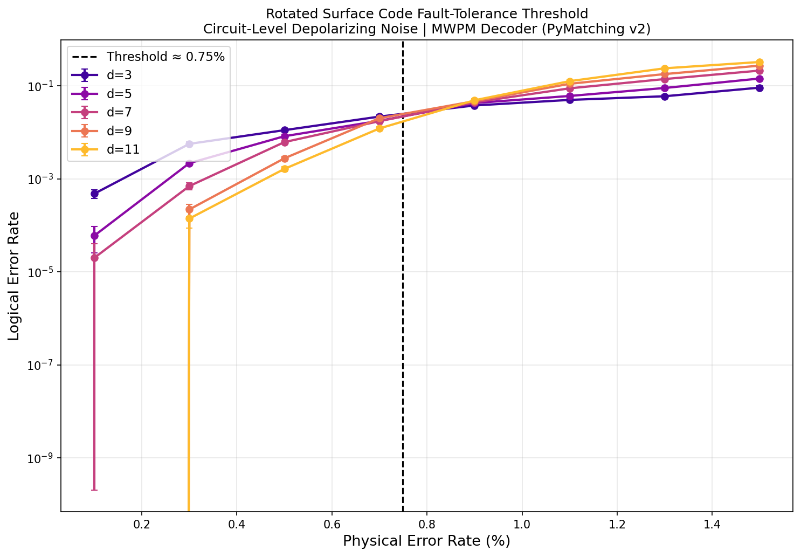
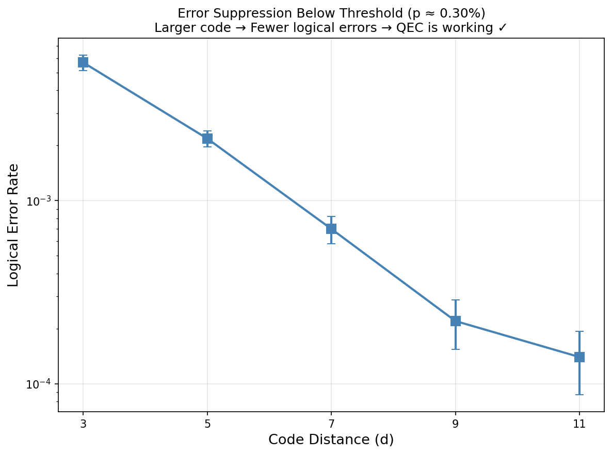

<div align="center">
  
</div>

<br/>

<div align="center">
  <strong>High-Performance Surface Code Orchestration Framework</strong>
</div>

<div align="center">
  An automated HPC pipeline built on Stim, PyMatching, and Sinter that reproduces the ~0.7% fault-tolerance threshold under circuit-level noise.
</div>

<br/>

<div align="center">
  <a href="https://github.com/haber/QuantumFaultSim/actions">
    
  </a>
  <a href="https://badge.fury.io/py/quantumfaultsim">
    
  </a>
  <a href="https://github.com/psf/black">
    
  </a>
  <a href="LICENSE">
    
  </a>
</div>

<br/>

## Overview

Quantum computers are inherently fragile. To perform massive calculations without errors destroying the internal state, we use **Quantum Error Correction (QEC)**. 

**QuantumFaultSim** is an HPC-accelerated orchestration framework designed to automate Monte Carlo threshold simulations for the Rotated Surface Code. Rather than building a simulator from scratch, it serves as a highly modular pipeline combining `Stim`'s Clifford backend, `PyMatching`'s graph matching decoder, and `Sinter`'s parallel orchestration. This framework automatically distributes workloads across local CPU cores, manages heavy data collection, and computes accurate scaling thresholds.

---

## Core Architecture

| Module | Technology | Description |
| :--- | :--- | :--- |
| **Generators** | `Stim` | Compiles d-distance Surface Code circuits tracking spacetime Pauli errors. |
| **Decoders** | `PyMatching` | Solves Minimum Weight Perfect Matching (MWPM) graphs for syndrome detection. |
| **Orchestration** | `Sinter` | Dispatches adaptive, distributed data-collection nodes across CPU clusters. |

---

## Quickstart

Run your first 100,000-shot multiprocessor sweep in under two minutes.

```bash
# 1. Clone & Install
git clone https://github.com/your-username/QuantumFaultSim.git
cd QuantumFaultSim
python -m venv .venv && source .venv/bin/activate
pip install -e .

# 2. Execute HPC Sweep
quantumfaultsim sweep \
    --distances 3,5,7 \
    --p-start 0.001 --p-end 0.015 --p-steps 8 \
    --workers 4 \
    --max-shots 100000 
```
*Outputs, checkpoints, and visualization plots are strictly routed to the `results/` directory.*

For a deeper dive, check out the full [Quickstart Guide](docs/QUICKSTART.md).

---

## The Science: Proving the Threshold

The fundamental goal of QEC is validating the **Threshold Theorem**. 

<div align="center">
  
  
</div>

- **Left (Threshold Crossing):** If physical hardware error ($p$) is higher than $0.7\%$, scaling the quantum computer makes it *less* stable.
- **Right (Exponential Decay):** If hardware error is below the threshold, scaling up induces **Exponential Error Suppression** (straight lines down on a log-scale).

---

## Project Structure
```text
QuantumFaultSim/
├── quantumfaultsim/      # Core package engine
│   ├── circuits.py       # Stim integration & noise synthesis
│   ├── decoder.py        # PyMatching API wrapper
│   ├── parallel.py       # Sinter orchestration & Checkpoint I/O
│   ├── cli.py            # Click-based command interface
│   ├── config.py         # Pydantic rigorous type validation
│   ├── logger.py         # Structured system event tracking
│   ├── threshold.py      # SciPy crossing estimators
│   └── plots.py          # Matplotlib scientific renderers
├── scripts/              # Independent execution targets
├── tests/                # Pytest CI/CD Integration suite
├── docs/                 # Extended technical reports
└── results/              # Auto-generated CSVs and visuals
```

---


